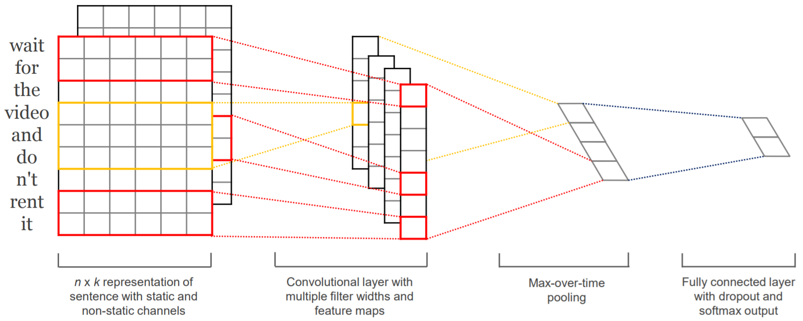

#### 说明：

1. 全体新加入研究组的同学，需要完成以下三个任务，完成的情况会反馈给导师，作为进一步培养的依据；
2. 在模型写完并完成训练后，请联系程序练习负责人获取测试集，然后用自己训好的模型推断获得结果，处理成要求的格式，命名为result.txt，发给负责人，负责人会计算测试结果；
3. 最后将全部代码+README.md说明文件打包成以自己学号命名的压缩包发给负责人；
4. 可以参考开源代码，但是最后提交的代码必须是自己写的；
5. 禁止使用除了训练集以外的任何数据用于训练，禁止使用验证集、测试集进行训练。

### 大家的毕业设计版本迭代记录

1. 请每个任务涉及到的同学使用同样的测试集（训练集可以根据自己的毕设题目做调整），并且禁止将测试集也用于训练；
2. 每一次大家对模型、训练策略进行改进后，都需要在测试集上测试，然后反馈给我，我会记录大家版本迭代的情况；

#### 中文分词

测试集：MSRA, http://sighan.cs.uchicago.edu/bakeoff2005/

#### 实体抽取

测试集：CoNLL03, https://www.clips.uantwerpen.be/conll2003/ner/

#### 术语抽取

测试集：自己构造的，训练集60798条，验证集1000条，测试集2000条

| 本科学号 | 测试时间 | model_architecture  | l_rate | batch | test_F1  | 说明 | 
| ------- | -------- | -------- | ------ | ----- | -------- | ----- |
| 2017061904 | 2021/xx/xx  | 单层BiLSTM | 2e-5 | 16 | xx.xx | 自己重写的师兄的代码 |
| 2017061904 | 2021/xx/xx  | 单层BiLSTM | 2e-5 | 16 | xx.xx | 使用了医药领域的训练数据进行了多任务训练，训练方式是将医药领域和MSRA的训练集混合，验证集和测试集都使用的是MSRA的 |
| 2017061904 | 2021/xx/xx  | 单层BiLSTM | 2e-5 | 16 | xx.xx | 在上一版本的基础上，用MSRA的数据集又单独进行了微调，然后再进行测试 |
| 2017061904 | 2021/xx/xx  | 单层BiLSTM+CRF | 2e-5 | 16 | xx.xx | 参照Pytorch官方教程写得CRF |

### 任务一：基于TextCNN的文本分类

数据集：[Large Movie Review Dataset](http://ai.stanford.edu/~amaas/data/sentiment/) 

参考论文：Convolutional Neural Networks for Sentence Classification，https://arxiv.org/abs/1408.5882

需要了解的知识点：

1. 文本特征表示：词向量
   1. 对word embedding随机初始化
   2. 用glove预训练的embedding进行初始化 https://nlp.stanford.edu/projects/glove/
2. CNN如何提取文本的特征

模型图：

 

说明：

1. 训练集25000句，测试集25000句，需要自己写脚本合在一起；
2. 请将训练集用于训练，测试集用于验证，最后我会再给你一个测试集；
2. 测试结果格式：每行对应一句话的分类结果；

当前的SOTA排名：https://github.com/sebastianruder/NLP-progress/blob/master/english/sentiment_analysis.md

### 任务二：基于ESIM的文本匹配

输入两个句子，判断它们之间的关系。参考ESIM（可以只用LSTM，忽略Tree-LSTM），用双向的注意力机制实现。

数据集：https://nlp.stanford.edu/projects/snli/

参考论文：Enhanced LSTM for Natural Language Inference，<https://arxiv.org/pdf/1609.06038v3.pdf>

模型图：

 

知识点：

1. 注意力机制在NLP中的应用

说明：

1. 训练集、验证集、测试集已经分割好了，但是你仅使用训练集和验证集即可，最后我会再给你一个测试集；
2. 测试结果格式：每行对应一个句对的匹配结果；

当前的SOTA排名：https://nlp.stanford.edu/projects/snli/

### 任务三：基于Bert的自然语言理解

Bert可以用来进行分类、标注、匹配等多种自然语言理解任务。这里需要用Bert重新实现上述两个任务中的任意一个。

建议使用的框架：Huggingface，https://github.com/huggingface/transformers

参考论文：BERT: Pre-training of Deep Bidirectional Transformers for Language Understanding，https://arxiv.org/abs/1810.04805

模型图：

 

知识点：

1. 预训练和预训练模型
2. 子词切分
3. 自注意力和transformer（不过不需要你自己写模型）
